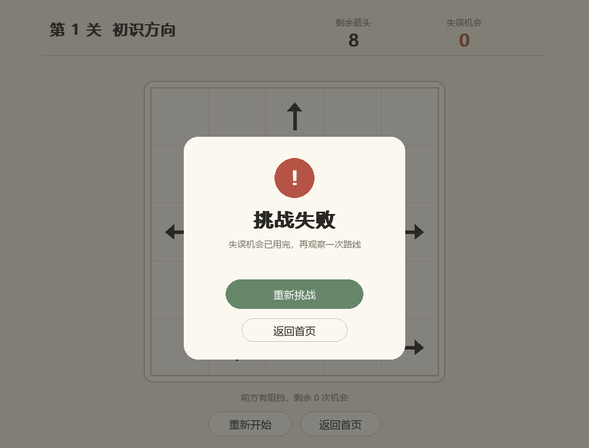

# 一箭又一箭

使用 Python 和 Pygame 开发的点击式箭头解谜游戏，采用米白简约风格。观察箭头的方向和阻挡关系，按合适的顺序清空棋盘。

## 游戏演示


## 游戏规则

- 鼠标点击箭头，前方没有其他箭头时即可飞出棋盘。
- 前方存在阻挡时，箭头碰撞后返回，并消耗一次失误机会。
- 每关有 3 次失误机会，耗尽后本关失败。
- 清空棋盘后点击“下一关”，共 3 个关卡。
- 支持连续点击；点击“重新开始”可恢复当前关卡。

## 安装与运行

开发环境：Windows、Python 3.12.14、pygame-ce 2.5.6。需要 Python 3.10 或以上版本。

下载仓库 ZIP 并解压，在项目目录打开终端运行：

```bash
python -m pip install -r requirements.txt
python app.py
```

## 游戏截图

<details>
<summary>查看开始、游戏、通关和失败界面</summary>




</details>

## 测试

```bash
python -m unittest discover -s tests -v
```

覆盖路径判断、失误与重开、关卡求解、连续点击及页面切换。详见[测试报告](docs/TEST_REPORT.md)。

## 开发说明

本项目使用 ChatGPT / Codex 辅助开发，界面与箭头均由程序绘制，未使用原商业游戏素材。实现思路与协作过程见[作业博客](docs/BLOG_DRAFT.md)。
