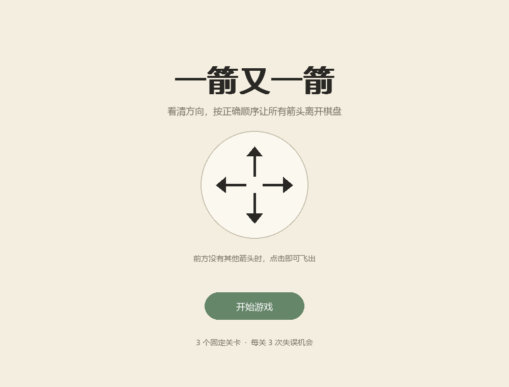
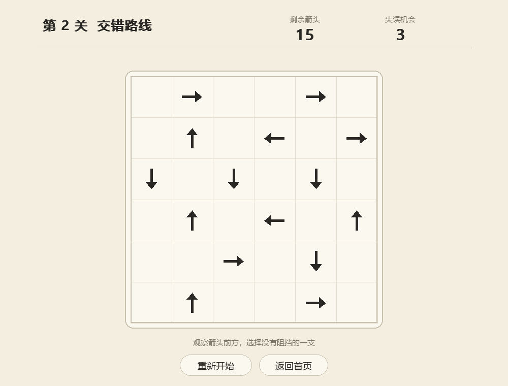
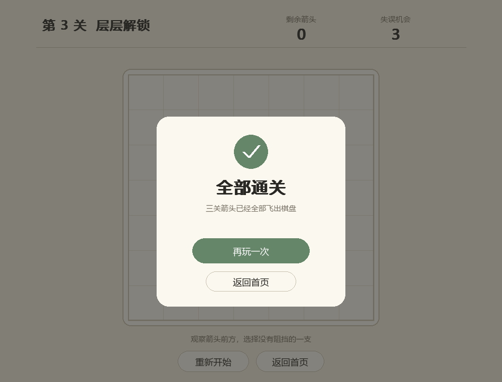
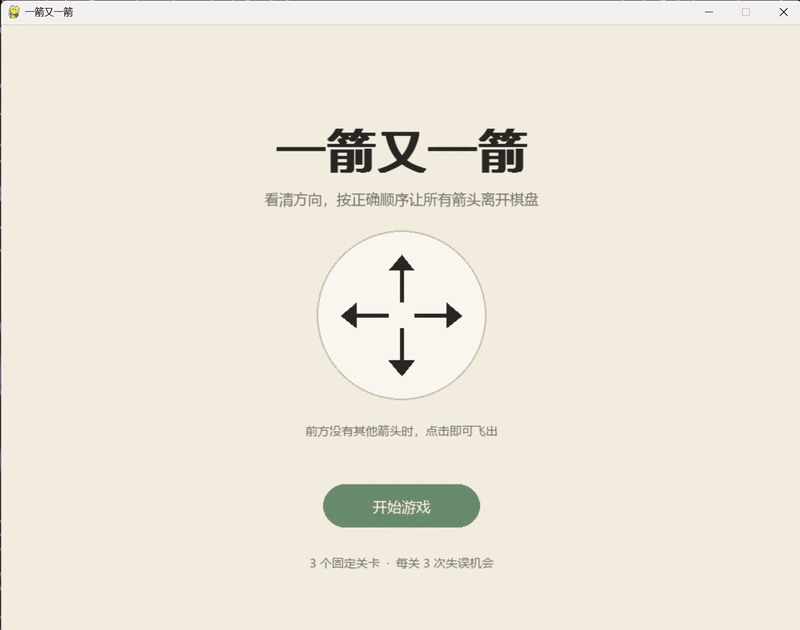

# 2026 秋软件工程个人作业（第二次）

| 项目内容 | 内容 |
| --- | --- |
| 这个作业属于哪个课程 | [2026软件工程](https://edu.cnblogs.com/campus/fzu/202601SofwareEngineering) |
| 这个作业要求在哪里 | [第二次个人作业](https://edu.cnblogs.com/campus/fzu/202601SofwareEngineering/homework/16717) |
| 这个作业的目标 | 使用 Python 和 AIGC 完成“一箭又一箭”小游戏 |
| 学号 | 102401421 |
| GitHub 仓库 | [Arrow_after_Arrow](https://github.com/SiJiu123/Arrow_after_Arrow) |

## 一、项目展示

### 开始界面



### 游戏界面



### 全部通关界面



以上为程序生成的界面演示截图。

### 游戏演示



## 二、项目介绍

“一箭又一箭”是一个点击式箭头解谜游戏。棋盘中的箭头分别朝上、下、左、右。点击箭头时，程序会检查它前进方向直到棋盘边界的所有格子：如果没有其他箭头，箭头就沿当前方向飞出并消失；如果存在阻挡，箭头会变红、向前轻撞后退回，同时扣除一次失误机会。每关有 3 次失误机会，清除全部箭头后进入下一关，机会耗尽则可以重新挑战。

项目包含 3 个固定关卡、开始与结果界面、剩余箭头和失误次数显示、重新开始功能，以及飞出和碰撞动画。所有图形均由程序绘制，没有使用原商业游戏素材。

## 三、实现思路

每支箭头使用编号、行、列和方向表示，行列索引从0开始。关卡保存棋盘尺寸、初始箭头集合和允许失误次数，重新开始时恢复初始数据。

路径检测不需要遍历整个二维数组。程序遍历当前仍存在的箭头，只保留与被点击箭头处于同一行或同一列、并且严格位于其前进方向上的箭头。如果没有这样的箭头，路径畅通；如果有，则距离最近的一支是首次碰到的阻挡物。规则层不依赖 Pygame，因此可以单独进行自动化测试。

路径检测关键代码（摘自 `game_core.py`，补充方向获取语句）：

```python
dr, dc = arrow.direction.delta
row_gap = other.row - arrow.row
col_gap = other.col - arrow.col
same_ray = (
    (dr == 0 and row_gap == 0 and col_gap * dc > 0)
    or (dc == 0 and col_gap == 0 and row_gap * dr > 0)
)
```

`dr` 表示沿箭头方向前进一格时的行号变化，`dc` 表示列号变化：上、下、左、右分别对应 `(-1, 0)`、`(1, 0)`、`(0, -1)`、`(0, 1)`。代码先判断另一支箭头是否同行或同列，再通过差值与方向增量的乘积是否大于 0，判断它是否位于前方。

三个关卡使用固定数据，难度通过增加阻挡依赖逐步提升。求解器用于检查关卡是否可通关：它在独立的箭头列表中反复模拟删除当前无阻挡的箭头，直到全部清空，或者剩余箭头都无法移动。删除只会减少阻挡，因此无需回溯。三个关卡均通过可解性验证；玩家实际点击时会按当前布局重新判断阻挡，不需要查询求解器生成的通关顺序。

## 四、AIGC 使用过程

使用工具为ChatGPT / Codex。我负责提出需求、选择风格、试玩和反馈，代码与测试修改由Codex完成。

| 子任务 | AIGC 工具 | 提出的要求 | AI 实现或提供了什么 | 实际效果 | 审核与修改 |
| --- | --- | --- | --- | --- | --- |
| 需求与结构设计 | ChatGPT / Codex | 使用 Python 完成基础玩法，米白简约风，并保留过程和计时 | 拆分规则、关卡、主题、界面和测试模块 | 覆盖了基础评分项，样式可独立替换 | 决定先完成基础版，暂不加入计时、道具和随机关卡 |
| 路径检测与关卡 | ChatGPT / Codex | 实现四方向判断和至少 3 个可通关关卡 | 生成规则模块、固定关卡和求解器 | 三关均找到完整解 | 补充边界与重开测试，后续简化求解器 |
| 界面与动画调试 | ChatGPT / Codex | 制作米白简约界面、飞出和碰撞反馈 | 绘制三类界面与两类动画，并生成实际截图 | 首次运行出现字体异常，首次有效截图还发现底部重叠 | 改为直接加载中文字体文件，缩小棋盘最大尺寸；复核截图后正常 |
| 连续点击节奏 | ChatGPT / Codex | 本人试玩发现动画期间不能点下一支，要求改善节奏 | 将全局动画锁改成并行动画列表 | 第一支仍在飞行时可以立即点击下一支 | 防止碰撞期间重复扣错；阻挡解除后可立即重试 |
| 结果页导航修复 | ChatGPT / Codex | 本人提供截图并反馈“返回首页”无法点击 | 分析点击处理和逐帧状态切换 | 发现按钮实际已响应，但旧通关状态在下一帧重新打开结果页 | 限制结果跳转只能从游戏页面触发，并测试通关、全部通关和失败三种情况 |

## 五、测试结果

| 编号 | 测试内容 | 预期结果 | 实际结果 | 是否通过 |
| --- | --- | --- | --- | --- |
| T01 | 点击前方无阻挡的箭头 | 箭头飞出棋盘并消失 | 返回 removed，箭头从状态中删除 | 通过 |
| T02 | 点击前方有阻挡的箭头 | 箭头不消失，失误次数减 1 | 返回 blocked，保留箭头并从 3 次减为 2 次 | 通过 |
| T03 | 点击边缘且朝棋盘外的箭头 | 正常消失，不越界 | 四个方向的边缘用例均正常删除 | 通过 |
| T04 | 消除本关全部箭头 | 显示通关并进入下一关 | 状态变为 won，界面动画结束后显示结果页 | 通过 |
| T05 | 失误次数耗尽 | 显示失败并允许重新开始 | 连续 3 次受阻后状态变为 lost | 通过 |
| T06 | 游戏中重新开始 | 布局和失误次数恢复 | 初始箭头和 3 次机会均恢复 | 通过 |

使用unittest完成规则与界面流程测试，20项测试全部通过。除T01—T06外，还覆盖连续点击、无解环、完整三关流程和结果页返回首页。界面自动测试通过点击坐标入口执行；本人试玩另发现并推动修复了连续点击慢、返回首页失效两个问题。

## 六、PSP 表格

耗时单位为小时，差异为实际耗时减去预估耗时。

| 任务 | 预估耗时（小时） | 实际耗时（小时） | 差异（小时） |
| --- | ---: | ---: | ---: |
| 需求分析与游戏设计 | 0.6 | 0.7 | +0.1 |
| Python 与图形库学习 | 0.9 | 0.6 | -0.3 |
| 游戏界面实现 | 1.7 | 2.1 | +0.4 |
| 路径与碰撞逻辑实现 | 1.4 | 1.6 | +0.2 |
| 关卡设计 | 0.9 | 1.2 | +0.3 |
| AIGC 辅助开发 | 0.8 | 1.1 | +0.3 |
| 测试与修改 | 1.3 | 1.8 | +0.5 |
| README 与博客撰写 | 1.6 | 2.0 | +0.4 |
| 合计 | **9.2** | **11.1** | **+1.9** |

## 七、心得体会

这次作业让我体会到，AIGC可以加快从需求到可运行程序的过程，但“能运行”并不等于“好用”。试玩时，我发现连续点击需要等待动画，通关后又遇到返回首页失效。把具体操作和截图反馈给Codex后，问题才得到定位和修复。自动测试与实际试玩需要结合，才能发现规则之外的交互问题。

我也认识到，动画与游戏状态需要分开处理，关卡难度要看阻挡关系，而不只是箭头数量。优化后，连续操作更顺畅，后两关也增加了解锁层次，我对当前版本的整体体验比较满意。

我在开发前就要求保留过程记录，后续还核对并纠正了助手的计时记录。使用AI既要提出明确需求，也要检查它是否落实，并通过源码、测试和提交记录理解结果。对我来说，这比只得到一份可以运行的代码更有价值。
